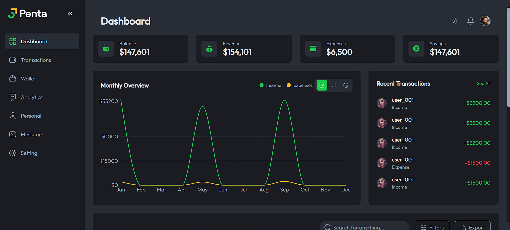
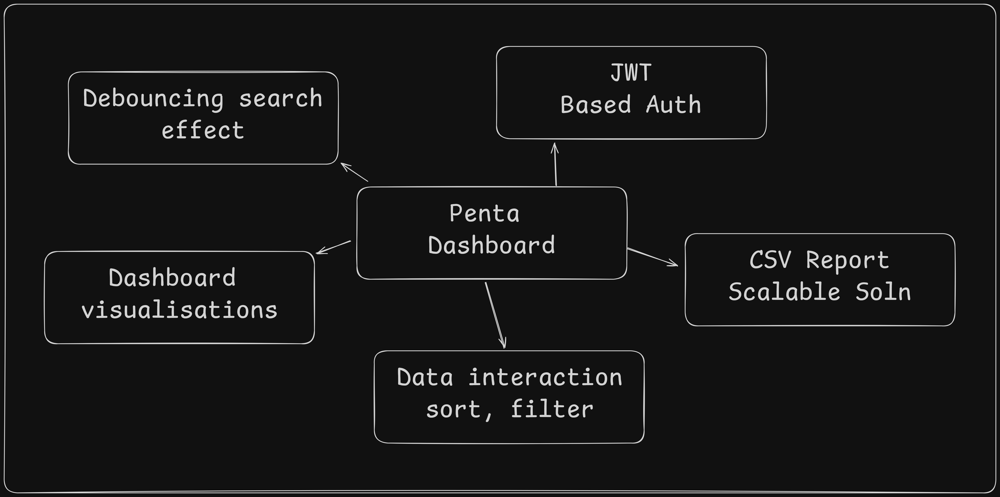
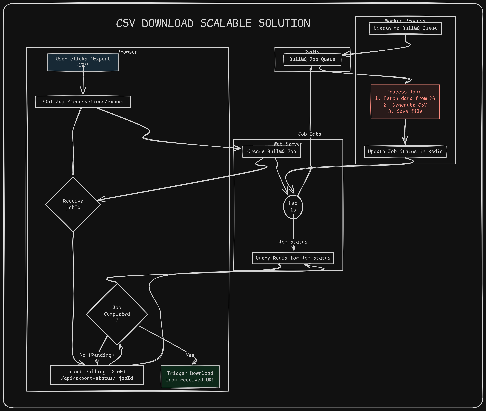
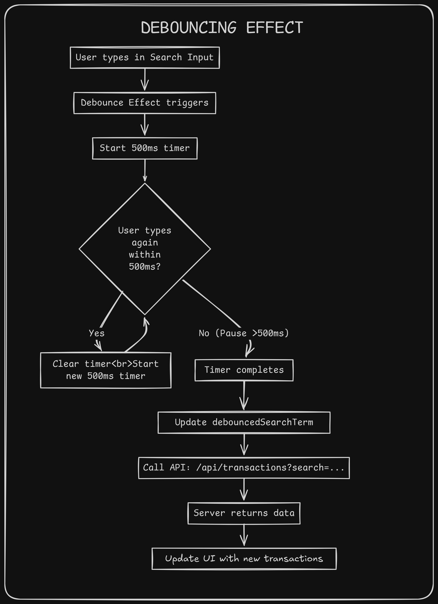
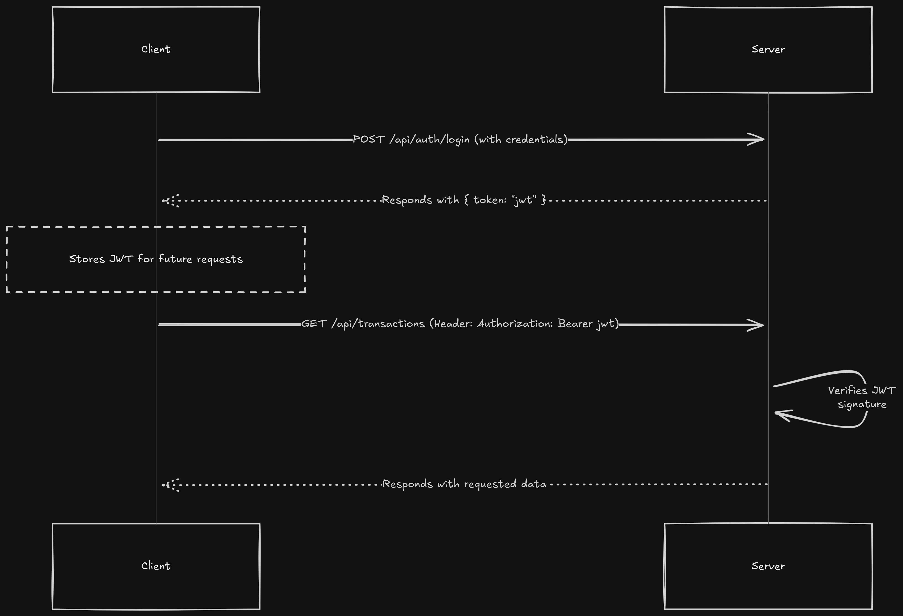

# Penta -> Financial Analytics Dashboard

This is an assignment submission for full stack intern position at loopr-ai (https://www.loopr.ai/). 





- Name - Kedar Vartak
- Linkedin - www.linkedin.com/in/kedar-vartak20
- Mail ID - kedar.vartak22@vit.edu
- Submission video - https://www.youtube.com/watch?v=yuaLJT-A-gc

## Table of Contents

1.  [Project Overview](#project-overview)
2.  [Tech Stack](#tech-stack)
3.  [Key Features & Technical Highlights](#key-features--technical-highlights)
    -   [Interactive Analytics Dashboard](#interactive-analytics-dashboard)
    -   [Scalable CSV Export Job System](#scalable-csv-export-job-system)
    -   [Performant Search with Debouncing](#performant-search-with-debouncing)
    -   [Secure JWT Authentication](#secure-jwt-authentication)
4.  [API Documentation](#api-documentation)
5.  [Getting Started](#getting-started)
    -   [Prerequisites](#prerequisites)
    -   [Installation](#installation)
    -   [Running the Development Environment](#running-the-development-environment)
6.  [Project Structure](#project-structure)

---

## 1. Project Overview

Penta is a simple and user-friendly web app that helps you manage your money. You can check your balance, see your income and expenses, and view insights on a dashboard. It has a clean, responsive design with customizable colors. The app is built with three parts: the frontend you see, a backend server, and a background worker for handling longer tasks.





## 2. Tech Stack

The application is built upon a robust, modern technology stack to ensure scalability, maintainability, and a high-quality user experience.

| Category      | Technology    | Purpose in this Project                                                                                             |
| :------------ | :------------ | :------------------------------------------------------------------------------------------------------------------ |
| **Frontend**  | React         | A JavaScript library for building the user interface with a component-based architecture.                           |
|               | TypeScript    | A statically typed superset of JavaScript that enhances code quality and maintainability.                           |
|               | Tailwind CSS  | A utility-first CSS framework used for rapidly building custom user interfaces with a consistent design system.         |
| **Backend**   | Node.js       | A JavaScript runtime environment that allows for building fast and scalable server-side applications.                 |
|               | Express.js    | A minimal and flexible Node.js web application framework used to build the RESTful API server.                      |
| **Database**  | MongoDB       | The primary NoSQL database used for storing all user and transactional data.                                         |
| **Job Queue** | BullMQ        | A robust job queue system for Node.js, used to manage and process long-running background tasks like CSV exports.     |
|               | Redis         | An in-memory data store used as the high-performance backend for BullMQ and for caching job statuses.               |

## 3. Key Features & Technical Highlights

### Interactive Analytics Dashboard

The application features a comprehensive analytics dashboard that provides users with multiple ways to visualize their financial data. This includes interactive charts for analyzing income vs. expenses over time, breaking down spending by category, and tracking monthly financial trends.

### Scalable CSV Export Job System

A key feature of the application is its ability to export large transaction histories to CSV without freezing the user interface. This is achieved through an asynchronous, scalable architecture:

1.  **Job Queuing**: When a user requests a CSV export, the Express server does not generate the file directly. Instead, it places a job onto a **BullMQ** queue, which is managed by **Redis**. This action is instantaneous, and the server immediately returns a unique `jobId` to the client.
2.  **Background Processing**: A dedicated **worker process** listens to the queue, picks up the job, and performs the heavy lifting of fetching data from the database and compiling the CSV file.
3.  **Client-Side Polling**: The frontend uses the `jobId` to periodically poll a status endpoint on the server. The server, in turn, checks the job's status in Redis.
4.  **Automatic Download**: Once the worker completes the job, it updates the status in Redis and provides a download URL. The next time the client polls, it receives the "completed" status and the URL, automatically triggering the file download for the user.

This decoupled system ensures that the application remains fast and responsive, regardless of the size of the export, and can be easily scaled by adding more worker processes.



### Performant Search with Debouncing

To optimize performance and reduce server load, the transaction search functionality implements a debouncing mechanism.

-   **How it Works**: As a user types in the search input field, an API request is not sent for every keystroke. Instead, a timer is set. If the user continues to type, the timer is reset. The API request is only fired after the user has paused typing for a set duration (e.g., 500ms).
-   **Benefits**: This technique dramatically reduces the number of API calls, leading to a smoother user experience and a more efficient backend. It prevents the UI from re-rendering on every keystroke and saves significant server and database resources.



### Secure JWT Authentication

The application uses JSON Web Tokens (JWT) for stateless, secure user authentication. This approach ensures that the server does not need to store session information, making the system more scalable and robust.

1.  **Login**: When a user logs in with their credentials, the Express server validates them.
2.  **Token Generation**: Upon successful validation, the server generates a signed JWT containing a payload with the user's ID. This token is then sent back to the client.
3.  **Client-Side Storage**: The frontend client stores this JWT in local storage and includes it in the `Authorization` header for all subsequent requests to protected API routes.
4.  **Server-Side Verification**: A custom middleware on the server intercepts incoming requests, verifies the JWT's signature, and extracts the user's identity from the payload. If the token is valid, the request is authorized and processed.





## 4. API Documentation

The following tables provide documentation for the core REST API endpoints. All authenticated routes require a Bearer token in the `Authorization` header.

### Authentication

| Method | Endpoint              | Description                      | Auth Required | Request Body                            |
| :----- | :-------------------- | :------------------------------- | :------------ | :-------------------------------------- |
| `POST` | `/api/auth/register`  | Registers a new user.            | No            | `{ "username", "email", "password" }`   |
| `POST` | `/api/auth/login`     | Logs in an existing user.        | No            | `{ "email", "password" }`               |

### Transactions

| Method | Endpoint               | Description                                                                                                   | Auth Required | Query Parameters                                                                                             |
| :----- | :--------------------- | :------------------------------------------------------------------------------------------------------------ | :------------ | :----------------------------------------------------------------------------------------------------------- |
| `GET`  | `/api/transactions`    | Fetches a paginated, sorted, and filtered list of transactions.                                               | Yes           | `page`, `limit`, `sortBy`, `order`, `search`, `startDate`, `endDate`, `category`, `status`, `minAmount`, `maxAmount` |
| `POST` | `/api/transactions/export` | Initiates an asynchronous job to export transactions to a CSV file based on provided filters and columns. | Yes           | `{ "columns": [], "filters": {}, "sort": {}, "search": "" }`                                                  |

### Export Jobs

| Method | Endpoint                   | Description                                  | Auth Required | Response Body                                                 |
| :----- | :------------------------- | :------------------------------------------- | :------------ | :------------------------------------------------------------ |
| `GET`  | `/api/export-status/:jobId` | Polls for the status of a CSV export job.    | Yes           | `{ "status": "completed" \| "pending" \| "failed", "url?": "..." }` | 

## 5. Getting Started

Follow these instructions to set up and run the project on your local machine.

### Prerequisites

-   Node.js (v18.x or later)
-   npm (v9.x or later)
-   Redis Cloud configuration in the env file 
-   A configured `.env` file in the `express` directory with your database connection string and other environment variables.
-   env file should contain redis cloud console uri, mongodb uri, jwt secret

### Installation

1.  Clone the repository to your local machine:
    ```bash
    git clone https://github.com/kedarvartak/loopr-ai
    cd loopr-ai
    ```
2.  Install frontend dependencies:
    ```bash
    cd frontend
    npm install
    ```
3.  Install backend and worker dependencies:
    ```bash
    cd ../express
    npm install
    ```

### Running the Development Environment

To simplify the startup process, a batch file is provided in the root directory. This script will open three separate terminal windows and run the development servers for all required services.

From the **root directory** of the project, run:
```bash
start-dev.bat
```

This will execute the following commands:
1.  **Frontend**: `npm run dev` in the `/frontend` directory.
2.  **Backend**: `npm run dev` in the `/express` directory.
3.  **Worker**: `npm run worker:dev` in the `/express` directory.

## 6. Project Structure

The project is organized as a monorepo with the following high-level directory structure:

```
/
├── express/        # Backend Express.js server and Worker logic
│   ├── src/
│   ├── package.json
│   └── ...
├── frontend/       # Frontend React client
│   ├── src/
│   │   ├── components/
│   │   ├── pages/
│   │   └── ...
│   ├── public/
│   └── package.json
├── start-dev.bat   # Batch script to start all services
└── README.md
``` 
